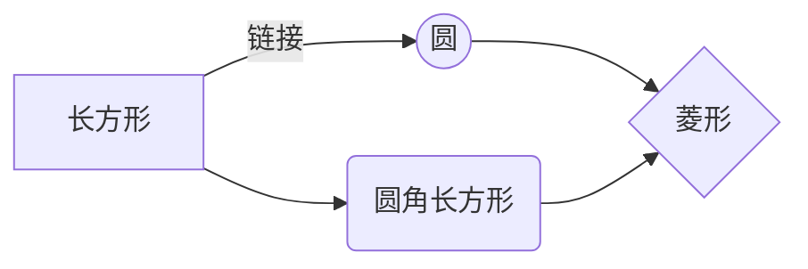
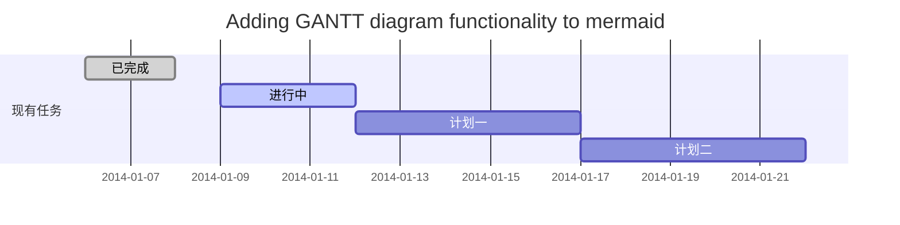

# 0805

细节面板

1. 多次定义类（已解决）
2. 返回扩展，对于已经有的对象，全局的比如材质，天光。扩展后返回的表

安排：

1. 细节面板
2. 双层饼图
3. 单元测试


**待办**

- 修显示器
- 带回显卡和网线
- 安装系统

# 0806

**细节面板**

1. 材质类这种全局的，是否还需要return
2. 天空盒
3. 天光方向编辑目录收缩下面的UI不显示，拖拽后显示
4. 天光的方向编辑（之后修改成只读属性）

**像素内容的接口**

patch合并提交

**备忘**

负号右边的空格

测试模块的内容修改及格式

修改测试代码的requrie

**待办**

- 系统激活
- 暴雪邮箱
- 公积金联名卡办理
- 东娃
- 茹

# 0807

DDGI算法：游戏全局光算法


# 0809

## 录制和模拟运行的接口

讨论自动录制和重播的回调

### 方案

接口：

_sys:onMessage(function( ... ) end)

_sys:sendMessage( ... )

方案：

在engine加process改函数

engine加记录的数组

在3D加接口、分发消息和记录按下的状态

### 单元测试

engine单元测试（传递消息的函数、isKeyDown）

lua单元测试

# 0810

引擎测试：

1. 添加测试框架

   >UnitTest_FancyPlatform项目
   >
   >- UnitTest_MainWindowMsg
   >
   >  UnitTest_MainWindowMsg_ProcessMessage( )
   >
   >- UnitTest_System
   >
   >  UnitTest_System_IsKeyDown( )

2. 解决编译错误

3. 添加简单测试内容

   false

4. GetMainWindow( )空指针，报错

5. 换成WinMain扔报错

6. 需要有CreateGraphicsManager( );


1. 测试环境（8.10 18:30）
2. engine添加ProcessMessage功能测试（8.12 11:30）
3. engine添加录制测试和录制回调（8.12 14:00）
4. engine添加IsKeyDown功能测试（8.12 15:30）
5. engine添加IsKeyDown记录的测试和回调（8.12 17:00）
6. 3D中添加对lua的录制接口（8.12 17:30）
7. 3D中添加发消息函数（改变按键状态）（8.12 18:30）
8. 测试/调整lua的单元测试（8.12 20:30）
9. 宏/代码结构/检查代码/提交


program


下周：

1. 接口

2. 集成测试


素材：

- 记录文档的工具（方便svn上修改，更新，图示方便）

  **文档**

  - 对外说明文档（类似书籍目录浏览）
  - 对内设计思路说明及代码结构图示（图可以由代码生成，方便维护和版本更新）

  **另一种方案**

  - 网页文档，更新网页
  - 但是对于注释类型的文档，方便后来人修改，则网页不适合了

- 太极拳

- static

- 小工具

  carbon-VSCode插件 生成代码的工具


- [ ] 待办

## UML 图表

  可以使用UML图表进行渲染。 [Mermaid](https://mermaidjs.github.io/). 例如下面产生的一个序列图：:

  ```mermaid
  sequenceDiagram
  张三 ->> 李四: 你好！李四, 最近怎么样?
  李四-->>王五: 你最近怎么样，王五？
  李四--x 张三: 我很好，谢谢!
  李四-x 王五: 我很好，谢谢!
  Note right of 王五: 李四想了很长时间, <br/>文字太长了<br/>不适合放在一行.
  
  李四-->>张三: 打量着王五...
  张三->>王五: 很好... 王五, 你怎么样?
  ```



```mermaid
flowchat
st=>start: 开始
e=>end: 结束
op=>operation: 我的操作
cond=>condition: 确认？

st->op->cond
cond(yes)->e
cond(no)->op
```

```mermaid
st=>start: Start:>http://www.google.com[blank]
e=>end:>http://www.google.com
op1=>operation: My Operation
sub1=>subroutine: My Subroutine
cond=>condition: Yes
or No?:>http://www.google.com
io=>inputoutput: catch something...
para=>parallel: parallel tasks

st->op1->cond
cond(yes)->io->e
cond(no)->para
para(path1, bottom)->sub1(right)->op1
para(path2, top)->op1
```

学习自定义列表

: 第一

: 第二


- 关于 **甘特图** 语法，参考 [这儿][2],

分享：

记录文档的语言或工具，方便更新文档

当前pdf的不足之处：

- 修改不方便，如果之后其他人修改了这个模块，修改文档则需要重新写一遍再导出为pdf

## 学习安排

minux

3d渲染

图形学

游戏

Latex

UE代码

**笔记备忘**

多种for循环（lua，C++）