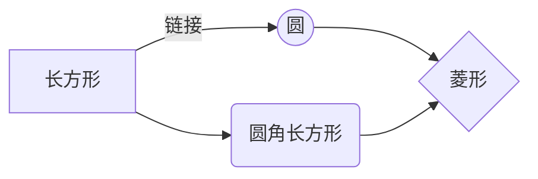
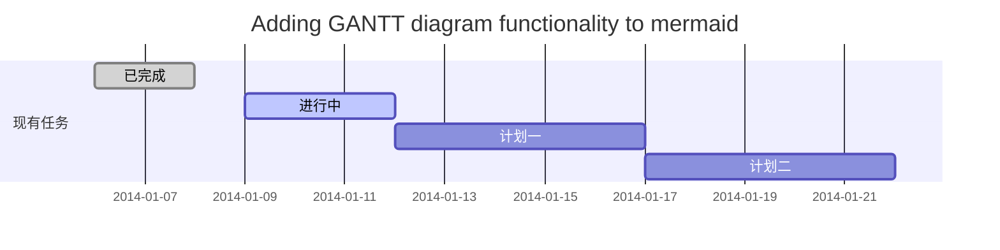

# 0812

## 引擎接口

  ```mermaid
sequenceDiagram
lua ->> 3D: 执行某一个动作
3D --x engine: 记录按键状态/执行ProcessMessage
engine ->> 3D: 触发Process并记录参数
3D ->> lua: 回调给msg参数
Note right of engine: 模拟重播<br/>录制.

lua ->>lua: 测试
  ```

Process函数测试：

测什么？

目的：

测试原功能正常（全部assert true）

添加的新功能不影响原来功能的测试（）

# 0813

测试老功能：

1. mousewheel（测试win7功能正常）
2. onDrag（文件参数没有测试，只测试了是否调用）
3. IME相关（不测试）

**初始化问题**

**static用法**

类static数组

非法下标访问，没有报错？


测试问题：

1. OnMouseUp右键抬起，会先触发MouseUp，然后再触发 ReleaseMouse 事件，msg = （0x205，0， 0）
2. 输入法：IME不支持，因为IME不走OnChar回调；英文走OnChar回调。
3. 测试复制剪贴等快捷键，是否好用。


# 0815

**当前的功能**

1. 记录相关的操作数据（数据不全面）

2. 根据给的操作数据发送消息（在发送消息前的系统行为没有测到。比如窗口大小变化，只测试到触发了_app:onResize()，窗口真正的显示大小没有变化）
3. 复杂情形（如复合键需要测试是否真的重播，还有快捷键等情形，中文输入不支持(IME)）

**测试结果**

- 鼠标滚动正常，剪贴板可以用，ctrl、shift组合使用正常

- 窗口大小实际不变化

**修改**

-  窗口用_rd.w/h设置（3D中调用set函数）

**测试结果**

- 窗口变化过程中，窗口大小变化和显示正常（但是截图是黑屏实际不需要截屏）


测试：

_rd.w设置会不会触发onResize

WM_SIZE之前是什么事件触发的（记录比如双击标题栏等事件）


拖动变化

msgid | msgid(0x) |  msg  
-|-|-
15 | f |WM_PAINT
275 |113|WM_TIMER
532 |214|WM_SIZING
70 |46|WM_WINDOWPOSCHANGING
36 |24|WM_GETMINMAXINFO
131 |83|WM_NCCALCSIZE
133 |85|WM_NCPAINT
20 |14|WM_ERASEBKGND
71 |47|WM_WINDOWPOSCHANGED
5 |5|WM_SIZE

双击窗口

msgid | msgid(0x) |  msg  
-|-|-
163 | A3 |WM_NCLBUTTONDBLCLK
274 |112|WM_SYSCOMMAND
(36) |24|WM_GETMINMAXINFO (only maxsize)
70 |46|WM_WINDOWPOSCHANGING
36 |24|WM_GETMINMAXINFO
131 |83|WM_NCCALCSIZE
133 |85|WM_NCPAINT
20 |14|WM_ERASEBKGND
71 |47|WM_WINDOWPOSCHANGED
3 |3|WM_MOVE
5 |5|WM_SIZE

点击最大化还原

msgid | msgid(0x) |  msg  
-|-|-
161 |A1|WM_NCLBUTTONDOWN
533 | 215 |WM_CAPTURECHANGED
274 |112|WM_SYSCOMMAND
(36) |24|WM_GETMINMAXINFO (only maxsize)
70 |46|WM_WINDOWPOSCHANGING
36 |24|WM_GETMINMAXINFO
131 |83|WM_NCCALCSIZE
133 |85|WM_NCPAINT
20 |14|WM_ERASEBKGND
71 |47|WM_WINDOWPOSCHANGED
3 |3|WM_MOVE
5 |5|WM_SIZE


一个hexo

用来记录本地文档记录，方便预览

另一个同步github网页，做分享


# 0816

- _FancyStorage做什么用


待办：添加onResize的lua测试

# 0817

sample测试

1. 设置测试环境

   master

   - watch1
   - watch2
   - SampleTest1
   - SampleTest2

   setupExe {watch1/2}

   copyFob 1/2

2. 遍历文件夹逐个测试

3. 打扫环境

（测试框架，默认会有一个slave，在对比测试中用不到）


不吝啬于写函数

---

# 0807

DDGI算法：游戏全局光算法


素材：

- 记录文档的工具（方便svn上修改，更新，图示方便）

  **文档**

  - 对外说明文档（类似书籍目录浏览）
  - 对内设计思路说明及代码结构图示（图可以由代码生成，方便维护和版本更新）

  **另一种方案**

  - 网页文档，更新网页
  - 但是对于注释类型的文档，方便后来人修改，则网页不适合了

- 太极拳

- static

- 小工具

  carbon-VSCode插件 生成代码的工具


- [ ] 待办

## UML 图表

  可以使用UML图表进行渲染。 [Mermaid](https://mermaidjs.github.io/). 例如下面产生的一个序列图：:

  ```mermaid
  sequenceDiagram
  张三 ->> 李四: 你好！李四, 最近怎么样?
  李四-->>王五: 你最近怎么样，王五？
  李四--x 张三: 我很好，谢谢!
  李四-x 王五: 我很好，谢谢!
  Note right of 王五: 李四想了很长时间, <br/>文字太长了<br/>不适合放在一行.
  
  李四-->>张三: 打量着王五...
  张三->>王五: 很好... 王五, 你怎么样?
  ```



```mermaid
flowchat
st=>start: 开始
e=>end: 结束
op=>operation: 我的操作
cond=>condition: 确认？

st->op->cond
cond(yes)->e
cond(no)->op
```

```mermaid
st=>start: Start:>http://www.google.com[blank]
e=>end:>http://www.google.com
op1=>operation: My Operation
sub1=>subroutine: My Subroutine
cond=>condition: Yes
or No?:>http://www.google.com
io=>inputoutput: catch something...
para=>parallel: parallel tasks

st->op1->cond
cond(yes)->io->e
cond(no)->para
para(path1, bottom)->sub1(right)->op1
para(path2, top)->op1
```

学习自定义列表

: 第一

: 第二


- 关于 **甘特图** 语法，参考 [这儿][2],

分享：

记录文档的语言或工具，方便更新文档

当前pdf的不足之处：

- 修改不方便，如果之后其他人修改了这个模块，修改文档则需要重新写一遍再导出为pdf

## 学习安排

minux

3d渲染

图形学

游戏

Latex

UE代码

**笔记备忘**

多种for循环（lua，C++）